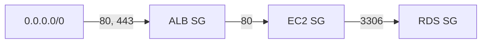
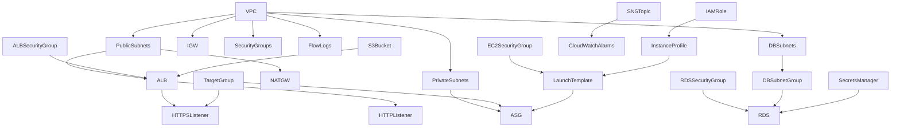

# 技術設計書: WEB三層アーキテクチャ CloudFormation テンプレート

## Overview

本設計書は、AWS CloudFormation を使用して ALB → EC2（Apache）→ RDS（MySQL 8.0）の WEB 三層アーキテクチャを構築する YAML テンプレートの技術設計を定義する。

### 設計方針

- **単一テンプレート構成**: すべてのリソースを1つの YAML テンプレートファイルに定義し、スタック間依存を排除する
- **パラメータ駆動**: 環境名、インスタンスタイプ、CIDR 等を外部パラメータ化し、テンプレートの再利用性を確保する
- **Well-Architected 準拠**: セキュリティ（最小権限、暗号化、IMDSv2）、信頼性（Multi-AZ、ASG）、コスト最適化（Graviton、単一 NAT GW）、運用（監視・通知）、パフォーマンス（Auto Scaling）、持続可能性（arm64）の6本柱に対応する

### 対象リージョン

ap-northeast-1（東京リージョン）。サブネットは ap-northeast-1a と ap-northeast-1c の2つの AZ に分散配置する。

### 成果物

- `template.yaml`: CloudFormation YAML テンプレート（単一ファイル）

## Architecture

### 全体構成図

```mermaid
graph TB
    subgraph Internet
        User[ユーザー]
    end

    subgraph VPC["VPC (10.0.0.0/16)"]
        subgraph PublicSubnets["Public Subnets"]
            ALB[ALB<br/>Internet-facing]
            NATGW[NAT Gateway]
        end

        subgraph PrivateSubnets["Private Subnets"]
            ASG[Auto Scaling Group]
            EC2a[EC2 Apache<br/>ap-northeast-1a]
            EC2c[EC2 Apache<br/>ap-northeast-1c]
        end

        subgraph DBSubnets["DB Subnets"]
            RDS[(RDS MySQL 8.0<br/>Multi-AZ)]
        end
    end

    subgraph AWSServices["AWS サービス"]
        SM[Secrets Manager]
        CW[CloudWatch]
        SNS[SNS]
        S3[S3 Access Logs]
        KMS[KMS]
        SSM[SSM Session Manager]
        FlowLogs[VPC Flow Logs]
    end

    User -->|HTTPS:443| ALB
    ALB -->|HTTP:80| EC2a
    ALB -->|HTTP:80| EC2c
    EC2a -->|MySQL:3306| RDS
    EC2c -->|MySQL:3306| RDS
    ASG --> EC2a
    ASG --> EC2c
    EC2a --> NATGW
    EC2c --> NATGW
    NATGW -->|Internet| Internet
    ALB -->|Access Logs| S3
    RDS -.->|認証情報| SM
    EC2a -.-> SSM
    EC2c -.-> SSM
    CW -->|アラーム| SNS
    VPC -.-> FlowLogs
    FlowLogs --> CW
end
```

### ネットワーク設計

| サブネット層 | AZ-a CIDR | AZ-c CIDR | 用途 |
|---|---|---|---|
| Public Subnet | 10.0.1.0/24 | 10.0.2.0/24 | ALB, NAT Gateway |
| Private Subnet | 10.0.11.0/24 | 10.0.12.0/24 | EC2 (Apache) |
| DB Subnet | 10.0.21.0/24 | 10.0.22.0/24 | RDS (MySQL) |

### セキュリティグループフロー



### ルーティング設計

- **Public Route Table**: 0.0.0.0/0 → Internet Gateway（Public Subnet x2 に関連付け）
- **Private Route Table**: 0.0.0.0/0 → NAT Gateway（Private Subnet x2 + DB Subnet x2 に関連付け）


## Components and Interfaces

### 1. CloudFormation パラメータ

テンプレートの入力パラメータとして以下を定義する。

| パラメータ名 | 型 | デフォルト値 | 説明 |
|---|---|---|---|
| EnvironmentName | String | dev | 環境名（リソース命名・タグに使用） |
| VpcCIDR | String | 10.0.0.0/16 | VPC の CIDR ブロック |
| EC2InstanceType | String | t4g.small | EC2 インスタンスタイプ |
| DBInstanceClass | String | db.t4g.small | RDS インスタンスクラス |
| DBName | String | appdb | データベース名 |
| DBMasterUsername | String | admin | DB マスターユーザー名 |
| NotificationEmail | String | （なし） | アラーム通知先メールアドレス |
| CertificateArn | String | （なし） | ACM 証明書 ARN |

### 2. ネットワーク層コンポーネント

#### VPC
- CIDR: `!Ref VpcCIDR`
- DNS サポート: 有効
- DNS ホスト名: 有効

#### サブネット（6つ）
- Public Subnet x2（MapPublicIpOnLaunch: true）
- Private Subnet x2
- DB Subnet x2

#### ゲートウェイ・ルーティング
- Internet Gateway x1（VPC にアタッチ）
- NAT Gateway x1（Public Subnet 1a に配置、EIP 付与）
- Public Route Table x1（IGW へのデフォルトルート）
- Private Route Table x1（NAT GW へのデフォルトルート）

### 3. セキュリティ層コンポーネント

#### セキュリティグループ（3つ）

| SG 名 | インバウンドルール | ソース |
|---|---|---|
| ALB SG | TCP 80, TCP 443 | 0.0.0.0/0 |
| EC2 SG | TCP 80 | ALB SG |
| RDS SG | TCP 3306 | EC2 SG |

#### IAM ロール
- EC2 用 IAM ロール
  - 信頼ポリシー: ec2.amazonaws.com
  - マネージドポリシー: AmazonSSMManagedInstanceCore, CloudWatchAgentServerPolicy
- VPC Flow Logs 用 IAM ロール
  - 信頼ポリシー: vpc-flow-logs.amazonaws.com
  - インラインポリシー: CloudWatch Logs への書き込み権限

#### Secrets Manager
- 自動生成パスワード: 32文字以上
- 除外文字: `"'@/\`（MySQL 非互換文字）

### 4. Web 層コンポーネント

#### ALB
- スキーム: internet-facing
- リスナー:
  - HTTPS:443 → ターゲットグループへフォワード（ACM 証明書使用）
  - HTTP:80 → HTTPS:443 へ 301 リダイレクト
- アクセスログ: S3 バケットへ出力

#### ターゲットグループ
- プロトコル: HTTP
- ポート: 80
- ヘルスチェック: `/health`（HTTP）

#### Launch Template
- AMI: Amazon Linux 2023 arm64（SSM パラメータ `/aws/service/ami-amazon-linux-latest/al2023-ami-kernel-default-arm64` で解決）
- インスタンスタイプ: `!Ref EC2InstanceType`
- IMDSv2 強制: HttpTokens=required, HttpPutResponseHopLimit=2
- EBS: gp3, 20GB, KMS 暗号化
- UserData: Apache + PHP + php-mysqlnd インストール、httpd 起動、index.php デプロイ

#### Auto Scaling Group
- MinSize: 2, MaxSize: 4, DesiredCapacity: 2
- サブネット: Private Subnet x2
- スケーリングポリシー: TargetTrackingScaling（CPU 平均 70%）

### 5. データ層コンポーネント

#### RDS MySQL
- エンジン: MySQL 8.0
- インスタンスクラス: `!Ref DBInstanceClass`
- Multi-AZ: true
- ストレージ暗号化: true（KMS）
- バックアップ保持期間: 7日
- MaxAllocatedStorage: 100（ストレージ自動スケーリング）
- DeletionPolicy: Snapshot
- DB Subnet Group: DB Subnet x2

### 6. 監視・ログ層コンポーネント

#### VPC Flow Logs
- トラフィックタイプ: ALL
- 送信先: CloudWatch Logs（保持期間 30日）

#### CloudWatch アラーム

| アラーム | メトリクス | 閾値 | 評価期間 |
|---|---|---|---|
| EC2 CPU | CPUUtilization | > 80% | 5分 x 2回 |
| RDS CPU | CPUUtilization | > 80% | 5分 x 2回 |
| ALB Unhealthy | UnhealthyHostCount | > 0 | 1分 x 2回 |
| RDS Storage | FreeStorageSpace | < 5GB | 5分 x 2回 |

#### SNS
- トピック: アラーム通知用
- サブスクリプション: Email（`!Ref NotificationEmail`）

### 7. ストレージ層コンポーネント

#### S3 バケット（ALB アクセスログ用）
- バケット名: `!Sub "${AWS::StackName}-alb-access-logs-${AWS::AccountId}"`
- 暗号化: SSE-S3（AES256）
- パブリックアクセスブロック: 全ブロック有効
- バージョニング: 有効
- バケットポリシー: ELB サービスアカウント（ap-northeast-1: 582318560864）からの書き込み許可

### 8. CloudFormation 出力

| 出力名 | 値 | 説明 |
|---|---|---|
| ALBDNSName | ALB の DNS 名 | アプリケーションアクセス URL |
| VpcId | VPC ID | VPC 識別子 |
| RDSEndpoint | RDS エンドポイントアドレス | DB 接続先 |
| SecretsManagerArn | Secrets Manager シークレット ARN | DB 認証情報参照先 |


## Data Models

### CloudFormation テンプレート構造

テンプレートは以下のセクション順序で構成する。

```yaml
AWSTemplateFormatVersion: "2010-09-09"
Description: "WEB三層アーキテクチャ (ALB → EC2 Apache → RDS MySQL 8.0)"

Parameters:
  # 8つのパラメータ定義

Resources:
  # --- ネットワーク層 ---
  # VPC, Subnets (x6), IGW, IGW Attachment, EIP, NAT GW
  # Route Tables (x2), Routes (x2), Subnet Associations (x6)

  # --- セキュリティ層 ---
  # Security Groups (x3), IAM Roles (x2), Instance Profile
  # Secrets Manager Secret

  # --- Web 層 ---
  # ALB, HTTPS Listener, HTTP Listener, Target Group
  # Launch Template, ASG, Scaling Policy

  # --- データ層 ---
  # DB Subnet Group, RDS Instance

  # --- ログ・監視層 ---
  # S3 Bucket (ALB Logs), Bucket Policy
  # VPC Flow Logs, Flow Logs Log Group
  # SNS Topic, SNS Subscription
  # CloudWatch Alarms (x4)

Outputs:
  # 4つの出力定義
```

### リソース論理名規則

リソースの論理名は以下の命名規則に従う。

| カテゴリ | 命名パターン | 例 |
|---|---|---|
| VPC | VPC | VPC |
| サブネット | {Layer}{AZ}Subnet | PublicSubnet1a, PrivateSubnet1c |
| セキュリティグループ | {Layer}SecurityGroup | ALBSecurityGroup |
| IAM ロール | {Purpose}Role | EC2Role, FlowLogsRole |
| ALB 関連 | ALB, ALB{Component} | ALBHttpsListener |
| EC2 関連 | {Component} | LaunchTemplate, AutoScalingGroup |
| RDS 関連 | DB{Component} | DBInstance, DBSubnetGroup |
| 監視 | {Target}{Metric}Alarm | EC2CPUAlarm, RDSStorageAlarm |

### タグ付けモデル

すべてのタグ付け可能なリソースに以下のタグを付与する。

```yaml
Tags:
  - Key: Environment
    Value: !Ref EnvironmentName
  - Key: Project
    Value: WebThreeTier
```

リソース名にも EnvironmentName を含める（例: `!Sub "${EnvironmentName}-vpc"`）。

### リソース間参照マップ



### パラメータバリデーション

| パラメータ | 制約 |
|---|---|
| EnvironmentName | AllowedValues は設定しない（自由入力） |
| VpcCIDR | CIDR 形式の文字列 |
| EC2InstanceType | AllowedValues で Graviton 系に制限可能 |
| DBInstanceClass | AllowedValues で Graviton 系に制限可能 |
| DBName | 英数字のみ |
| DBMasterUsername | 英数字のみ |
| NotificationEmail | メールアドレス形式 |
| CertificateArn | ACM 証明書 ARN 形式 |


## Correctness Properties

*プロパティとは、システムのすべての有効な実行において真であるべき特性や振る舞いのことである。人間が読める仕様と機械的に検証可能な正しさの保証を橋渡しする形式的な記述として機能する。*

本テンプレートは CloudFormation YAML ファイルという静的成果物であるため、プロパティベーステストは「テンプレートを YAML としてパースし、構造的な不変条件を検証する」形式で実施する。

### Property 1: 全タグ付け可能リソースに必須タグが存在する

*For any* タグ付けをサポートする CloudFormation リソース（AWS::EC2::VPC, AWS::EC2::Subnet, AWS::ElasticLoadBalancingV2::LoadBalancer 等）において、そのリソースの Tags プロパティに "Environment" タグ（値は `!Ref EnvironmentName`）と "Project" タグ（値は "WebThreeTier"）の両方が含まれていなければならない。

**Validates: Requirements 14.1, 14.2**

### Property 2: 全セキュリティグループが VPC に関連付けられている

*For any* テンプレート内の `AWS::EC2::SecurityGroup` リソースにおいて、その `VpcId` プロパティが VPC リソースへの参照（`!Ref VPC` または同等の参照）を持たなければならない。

**Validates: Requirements 2.4**

### Property 3: パスワード系パラメータが存在しない

*For any* テンプレートの Parameters セクションに定義されたパラメータにおいて、そのパラメータ名に "Password" または "password" を含むものが存在してはならない。

**Validates: Requirements 6.4**

### Property 4: テンプレートの構造的整合性

*For any* テンプレート内の `!Ref` または `Ref:` による参照において、参照先の論理 ID が同テンプレートの Parameters セクションまたは Resources セクション、もしくは AWS 疑似パラメータ（`AWS::StackName`, `AWS::AccountId`, `AWS::Region` 等）に存在しなければならない。同様に、`!GetAtt` または `Fn::GetAtt` による参照において、参照先の論理 ID が Resources セクションに存在しなければならない。

**Validates: Requirements 15.1, 15.4**

### Property 5: 全コンピュートリソースが Graviton (arm64) を使用する

*For any* EC2 インスタンスタイプのデフォルト値および RDS インスタンスクラスのデフォルト値において、それらが Graviton ファミリー（t4g, m7g, c7g, r7g 等の "g" サフィックスを持つファミリー）に属していなければならない。

**Validates: Requirements 12.1**


## Error Handling

### CloudFormation デプロイ時のエラーハンドリング

| エラーシナリオ | 対策 |
|---|---|
| ACM 証明書 ARN が無効 | CertificateArn パラメータに `AllowedPattern` を設定し、ARN 形式を検証する |
| メールアドレスが無効 | NotificationEmail パラメータに `AllowedPattern` でメール形式を検証する |
| CIDR ブロックの重複 | VpcCIDR パラメータに `AllowedPattern` で CIDR 形式を検証する。サブネット CIDR はテンプレート内で固定値を使用し重複を防止する |
| RDS 作成失敗 | DeletionPolicy: Snapshot により、スタック削除時にスナップショットを保持する |
| EC2 起動失敗 | ASG の MinSize=2 により、ヘルスチェック失敗時に自動的にインスタンスを置換する |
| NAT Gateway 作成失敗 | EIP の割り当てに依存するため、スタックのロールバックで自動的にクリーンアップされる |

### UserData 実行時のエラーハンドリング

- UserData スクリプト内で `set -e` を使用し、コマンド失敗時にスクリプトを停止する
- `cfn-signal` は使用しない（シンプルな構成を維持するため）。代わりに ALB ヘルスチェック（`/health`）でアプリケーションの正常性を確認する

### セキュリティ関連のエラー防止

| リスク | 対策 |
|---|---|
| DB パスワードの漏洩 | Secrets Manager で自動生成。パラメータとして受け付けない |
| IMDS v1 によるクレデンシャル窃取 | IMDSv2 を強制（HttpTokens=required） |
| S3 バケットの公開 | PublicAccessBlock で全ブロック有効 |
| 不要なインターネットアクセス | Private/DB サブネットは NAT GW 経由のみ。DB サブネットからのアウトバウンドは NAT GW 経由 |

## Testing Strategy

### テストアプローチ

本プロジェクトでは、CloudFormation YAML テンプレートという静的成果物を対象とするため、以下の2つのテストアプローチを併用する。

#### 1. ユニットテスト（Example-based）

YAML テンプレートをパースし、個別のリソース設定値を検証する。各受け入れ基準に対応する具体的なアサーションを記述する。

対象:
- 各リソースの存在確認と設定値の検証（Requirements 1〜13 の個別基準）
- パラメータ定義の検証（Requirement 10）
- 出力定義の検証（Requirement 11）
- 特定のセキュリティ設定の検証（IMDSv2、暗号化、パブリックアクセスブロック等）

#### 2. プロパティベーステスト（Property-based）

テンプレート全体に対する普遍的な不変条件を検証する。

対象:
- Property 1: 全タグ付け可能リソースの必須タグ検証
- Property 2: 全セキュリティグループの VPC 関連付け検証
- Property 3: パスワードパラメータ不在の検証
- Property 4: テンプレート内参照の整合性検証
- Property 5: Graviton インスタンスタイプの検証

### テストツール

- **言語**: Python 3.x
- **テストフレームワーク**: pytest
- **YAML パーサー**: PyYAML（`pyyaml`）
- **プロパティベーステスト**: Hypothesis
  - 各プロパティテストは最低 100 イテレーション実行する
  - 各テストにはコメントで設計プロパティへの参照を記載する
  - タグ形式: `Feature: web-three-tier-cfn, Property {number}: {property_text}`

### テスト実行方法

```bash
# ユニットテスト実行
pytest tests/test_template_unit.py -v

# プロパティベーステスト実行
pytest tests/test_template_properties.py -v
```

### テストカバレッジ方針

- ユニットテスト: 各受け入れ基準（Requirements 1〜15）に対して最低1つのテストケース
- プロパティテスト: 設計書の Correctness Properties（Property 1〜5）に対して各1つのプロパティテスト
- ユニットテストは具体的なバグを検出し、プロパティテストは普遍的な正しさを保証する。両者は補完的であり、両方が必要である

