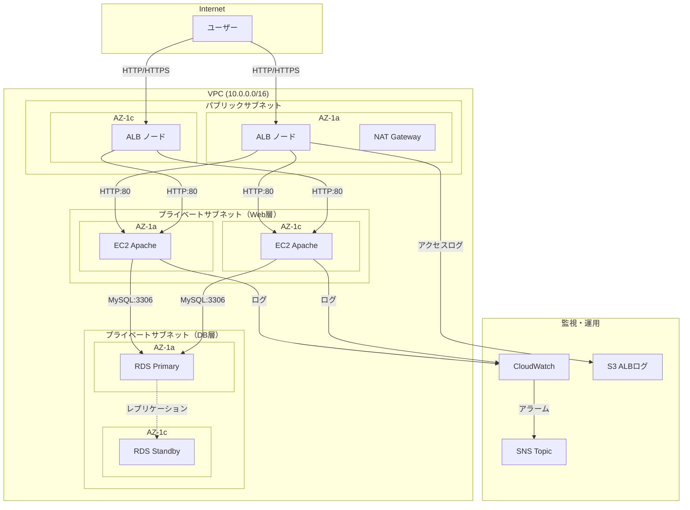
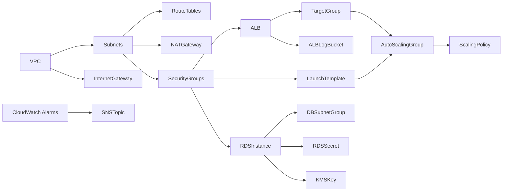

# 技術設計書: Well-Architected 3層アーキテクチャ CloudFormation テンプレート

## 概要（Overview）

本設計書は、AWS Well-Architected Framework の6本柱に準拠した WEB三層アーキテクチャ（ALB → EC2 Apache → RDS MySQL 8.0）を構築する CloudFormation テンプレートの技術設計を定義する。

テンプレートは単一の YAML ファイルとして構成し、以下の主要コンポーネントを含む：

- ネットワーク層（VPC、サブネット、ルーティング、NAT Gateway）
- プレゼンテーション層（ALB、リスナー、ターゲットグループ）
- アプリケーション層（EC2 Auto Scaling、起動テンプレート）
- データ層（RDS MySQL 8.0 Multi-AZ）
- セキュリティ（セキュリティグループ、IAM ロール、Secrets Manager）
- 監視・運用（CloudWatch Alarms、SNS、ログ基盤）

テンプレートは `AWSTemplateFormatVersion: '2010-09-09'` に準拠し、パラメータ化により dev/stg/prod 環境で再利用可能とする。

## アーキテクチャ（Architecture）

### 全体構成図



### サブネット設計

| サブネット | CIDR | AZ | 用途 |
|---|---|---|---|
| PublicSubnet1 | 10.0.1.0/24 | AZ-1a | ALB, NAT Gateway |
| PublicSubnet2 | 10.0.2.0/24 | AZ-1c | ALB |
| PrivateWebSubnet1 | 10.0.11.0/24 | AZ-1a | EC2 (Web層) |
| PrivateWebSubnet2 | 10.0.12.0/24 | AZ-1c | EC2 (Web層) |
| PrivateDBSubnet1 | 10.0.21.0/24 | AZ-1a | RDS (DB層) |
| PrivateDBSubnet2 | 10.0.22.0/24 | AZ-1c | RDS (DB層) |

### 設計判断

1. **NAT Gateway を1つのAZに配置**: コスト最適化のため単一AZ配置とする。プライベートサブネットからのアウトバウンド通信が一時的に不可になるリスクは許容する（要件9.3）
2. **単一テンプレートファイル**: ネストスタックを使用せず、単一YAMLファイルで全リソースを管理する。テンプレートの可読性と管理の簡素化を優先する
3. **Graviton インスタンスをデフォルト**: ARM系プロセッサにより電力効率とコストパフォーマンスを向上させる（要件9.4）
4. **HTTP リスナーのみ**: 証明書管理はテンプレートのスコープ外とし、HTTP（ポート80）リスナーのみ定義する。HTTPS対応は別途ACM証明書を用意した上で追加可能な構成とする


## コンポーネントとインターフェース（Components and Interfaces）

### テンプレート構造

CloudFormation テンプレートは以下のセクションで構成する：

```yaml
AWSTemplateFormatVersion: '2010-09-09'
Description: ...
Metadata: ...
Parameters: ...
Resources: ...
Outputs: ...
```

### コンポーネント一覧

#### 1. ネットワークコンポーネント

| リソース論理名 | リソースタイプ | 説明 |
|---|---|---|
| VPC | AWS::EC2::VPC | CIDR 10.0.0.0/16 のVPC |
| InternetGateway | AWS::EC2::InternetGateway | IGW |
| VPCGatewayAttachment | AWS::EC2::VPCGatewayAttachment | IGW-VPC アタッチ |
| PublicSubnet1 | AWS::EC2::Subnet | パブリックサブネット AZ-1a |
| PublicSubnet2 | AWS::EC2::Subnet | パブリックサブネット AZ-1c |
| PrivateWebSubnet1 | AWS::EC2::Subnet | Web層プライベート AZ-1a |
| PrivateWebSubnet2 | AWS::EC2::Subnet | Web層プライベート AZ-1c |
| PrivateDBSubnet1 | AWS::EC2::Subnet | DB層プライベート AZ-1a |
| PrivateDBSubnet2 | AWS::EC2::Subnet | DB層プライベート AZ-1c |
| NATGatewayEIP | AWS::EC2::EIP | NAT Gateway 用 Elastic IP |
| NATGateway | AWS::EC2::NatGateway | NAT Gateway（PublicSubnet1 に配置） |
| PublicRouteTable | AWS::EC2::RouteTable | パブリック用ルートテーブル |
| PublicRoute | AWS::EC2::Route | 0.0.0.0/0 → IGW |
| PrivateRouteTable | AWS::EC2::RouteTable | プライベート用ルートテーブル |
| PrivateRoute | AWS::EC2::Route | 0.0.0.0/0 → NAT Gateway |
| VPCFlowLog | AWS::EC2::FlowLog | VPC フローログ |
| VPCFlowLogGroup | AWS::Logs::LogGroup | フローログ用 LogGroup（保持90日） |
| VPCFlowLogRole | AWS::IAM::Role | フローログ用 IAM ロール |

#### 2. セキュリティグループコンポーネント

| リソース論理名 | リソースタイプ | インバウンドルール |
|---|---|---|
| ALBSecurityGroup | AWS::EC2::SecurityGroup | 0.0.0.0/0:80, 0.0.0.0/0:443 |
| EC2SecurityGroup | AWS::EC2::SecurityGroup | ALB SG:80 |
| RDSSecurityGroup | AWS::EC2::SecurityGroup | EC2 SG:3306 |

#### 3. ALB コンポーネント（プレゼンテーション層）

| リソース論理名 | リソースタイプ | 説明 |
|---|---|---|
| ALB | AWS::ElasticLoadBalancingV2::LoadBalancer | インターネット向け ALB |
| ALBListener | AWS::ElasticLoadBalancingV2::Listener | HTTP:80 リスナー |
| ALBTargetGroup | AWS::ElasticLoadBalancingV2::TargetGroup | EC2 ターゲットグループ |
| ALBAccessLogBucket | AWS::S3::Bucket | ALB アクセスログ用 S3 バケット |
| ALBAccessLogBucketPolicy | AWS::S3::BucketPolicy | ELB サービスからの書き込み許可 |

#### 4. EC2 Auto Scaling コンポーネント（アプリケーション層）

| リソース論理名 | リソースタイプ | 説明 |
|---|---|---|
| EC2LaunchTemplate | AWS::EC2::LaunchTemplate | Apache インストール、IMDSv2 強制、EBS 暗号化 |
| AutoScalingGroup | AWS::AutoScaling::AutoScalingGroup | Min:2, Max:4, Desired:2 |
| ScalingPolicy | AWS::AutoScaling::ScalingPolicy | CPU 70% ターゲット追跡 |
| EC2Role | AWS::IAM::Role | CloudWatch Logs + SSM 権限 |
| EC2InstanceProfile | AWS::IAM::InstanceProfile | EC2 用インスタンスプロファイル |

#### 5. RDS コンポーネント（データ層）

| リソース論理名 | リソースタイプ | 説明 |
|---|---|---|
| DBSubnetGroup | AWS::RDS::DBSubnetGroup | DB 層サブネットグループ |
| RDSInstance | AWS::RDS::DBInstance | MySQL 8.0, Multi-AZ, GP3, 暗号化 |
| RDSSecret | AWS::SecretsManager::Secret | マスターユーザー認証情報 |
| RDSSecretAttachment | AWS::SecretsManager::SecretTargetAttachment | Secret と RDS の紐付け |
| RDSMonitoringRole | AWS::IAM::Role | 拡張モニタリング用 IAM ロール |
| RDSKMSKey | AWS::KMS::Key | RDS ストレージ暗号化用 KMS キー |

#### 6. 監視コンポーネント

| リソース論理名 | リソースタイプ | 説明 |
|---|---|---|
| SNSTopic | AWS::SNS::Topic | アラーム通知用 SNS トピック |
| SNSSubscription | AWS::SNS::Subscription | メール通知サブスクリプション |
| ALB5xxAlarm | AWS::CloudWatch::Alarm | ALB 5xx エラー率 > 1% |
| RDSCPUAlarm | AWS::CloudWatch::Alarm | RDS CPU > 80% |
| RDSStorageAlarm | AWS::CloudWatch::Alarm | RDS 空きストレージ < 10GB |

### コンポーネント間の依存関係




## データモデル（Data Models）

### パラメータ定義

CloudFormation テンプレートのパラメータとして以下を定義する：

| パラメータ名 | 型 | デフォルト値 | AllowedValues | 説明 |
|---|---|---|---|---|
| EnvironmentName | String | prod | dev, stg, prod | 環境名 |
| ProjectName | String | web3tier | - | プロジェクト名（タグ・命名に使用） |
| EC2InstanceType | String | t4g.micro | t4g.micro, t4g.small, t4g.medium, t4g.large | EC2 インスタンスタイプ |
| RDSInstanceClass | String | db.t4g.micro | db.t4g.micro, db.t4g.small, db.t4g.medium, db.t4g.large | RDS インスタンスクラス |
| NotificationEmail | String | - | - | アラーム通知先メールアドレス |
| RDSAllocatedStorage | Number | 20 | - | RDS ストレージサイズ（GB） |

### リソース命名規則

全リソースは以下の命名規則に従う：

```
{EnvironmentName}-{ProjectName}-{ResourceType}
```

例: `prod-web3tier-vpc`, `prod-web3tier-alb`

### タグ戦略

全リソースに以下のタグを付与する：

| タグキー | 値 | 説明 |
|---|---|---|
| Environment | `!Ref EnvironmentName` | 環境名 |
| Project | `!Ref ProjectName` | プロジェクト名 |
| ManagedBy | CloudFormation | 管理方法 |

### Outputs 定義

| 出力名 | 値 | 説明 |
|---|---|---|
| VPCID | VPC の ID | VPC 識別子 |
| ALBDNSName | ALB の DNS 名 | アクセス用エンドポイント |
| PublicSubnet1ID | PublicSubnet1 の ID | パブリックサブネット1 |
| PublicSubnet2ID | PublicSubnet2 の ID | パブリックサブネット2 |
| PrivateWebSubnet1ID | PrivateWebSubnet1 の ID | Web層サブネット1 |
| PrivateWebSubnet2ID | PrivateWebSubnet2 の ID | Web層サブネット2 |
| PrivateDBSubnet1ID | PrivateDBSubnet1 の ID | DB層サブネット1 |
| PrivateDBSubnet2ID | PrivateDBSubnet2 の ID | DB層サブネット2 |
| RDSEndpoint | RDS のエンドポイント | DB 接続先 |
| RDSSecretARN | Secrets Manager の ARN | DB 認証情報参照先 |

### Secrets Manager シークレット構造

RDS マスターユーザー認証情報は以下の構造で Secrets Manager に格納する：

```json
{
  "username": "admin",
  "password": "<自動生成32文字、特殊文字除外>"
}
```

生成ルールは `GenerateSecretString` で定義し、`ExcludeCharacters: '"@/\\'` を指定する。

### Metadata セクション構造

パラメータグループを以下のように整理する：

```yaml
Metadata:
  AWS::CloudFormation::Interface:
    ParameterGroups:
      - Label:
          default: "環境設定"
        Parameters:
          - EnvironmentName
          - ProjectName
      - Label:
          default: "EC2 設定"
        Parameters:
          - EC2InstanceType
      - Label:
          default: "RDS 設定"
        Parameters:
          - RDSInstanceClass
          - RDSAllocatedStorage
      - Label:
          default: "通知設定"
        Parameters:
          - NotificationEmail
```

### UserData スクリプト（EC2 起動テンプレート）

```bash
#!/bin/bash
yum update -y
yum install -y httpd amazon-cloudwatch-agent
systemctl start httpd
systemctl enable httpd
echo "<h1>Hello from $(hostname)</h1>" > /var/www/html/index.html
```

### セキュリティグループルール詳細

#### ALB セキュリティグループ
- インバウンド: TCP 80 (0.0.0.0/0), TCP 443 (0.0.0.0/0)
- アウトバウンド: TCP 80 (EC2 SG)

#### EC2 セキュリティグループ
- インバウンド: TCP 80 (ALB SG)
- アウトバウンド: TCP 3306 (RDS SG), TCP 443 (0.0.0.0/0 - AWS API/yum用)

#### RDS セキュリティグループ
- インバウンド: TCP 3306 (EC2 SG)
- アウトバウンド: なし（デフォルト拒否）


## 正当性プロパティ（Correctness Properties）

*プロパティとは、システムの全ての有効な実行において成立すべき特性や振る舞いのことである。人間が読める仕様と機械的に検証可能な正当性保証の橋渡しとなる形式的な記述である。*

本テンプレートは Infrastructure as Code（CloudFormation YAML）であるため、正当性プロパティはテンプレートの構造解析（YAMLパース後のデータ構造検証）として実装する。テンプレートを YAML としてパースし、リソース定義が要件を満たしているかを検証する。

### Property 1: YAML ラウンドトリップ

*任意の*生成されたテンプレートに対して、YAMLとしてパースし再度シリアライズした結果を再パースした場合、元のデータ構造と等価であること。

**Validates: Requirements 10.1**

### Property 2: 全 LogGroup の保持期間設定

*任意の*テンプレート内の `AWS::Logs::LogGroup` リソースに対して、`RetentionInDays` プロパティが 90 に設定されていること。

**Validates: Requirements 6.5**

### Property 3: IAM ポリシーのワイルドカード不使用

*任意の*テンプレート内の IAM ポリシーステートメントに対して、`Resource` フィールドに単独のワイルドカード `"*"` が使用されていないこと。

**Validates: Requirements 7.5**

### Property 4: 全リソースのタグ付け

*任意の*テンプレート内のタグをサポートするリソースに対して、`Environment` タグと `Project` タグが付与されていること。

**Validates: Requirements 8.4**

## エラーハンドリング（Error Handling）

### テンプレートデプロイ時のエラー対策

| エラーシナリオ | 対策 |
|---|---|
| パラメータ値の不正 | AllowedValues による入力制限（EC2InstanceType, RDSInstanceClass, EnvironmentName） |
| リソース作成失敗 | CloudFormation の自動ロールバック機能に依存。DeletionPolicy は RDS に Snapshot を設定 |
| AZ 障害 | Multi-AZ 構成（ALB 2AZ、ASG 2AZ、RDS Multi-AZ）による冗長化 |
| ヘルスチェック失敗 | ALB ターゲットグループのヘルスチェックにより異常インスタンスを自動除外 |
| DB 認証情報漏洩 | Secrets Manager による管理。テンプレート内にパスワードをハードコードしない |
| ストレージ容量不足 | CloudWatch Alarm による事前通知（空きストレージ < 10GB） |
| 高負荷 | Auto Scaling による自動スケールアウト（CPU > 70%）、RDS CPU アラーム（> 80%） |

### DeletionPolicy 設定

| リソース | DeletionPolicy | 理由 |
|---|---|---|
| RDSInstance | Snapshot | データ保護のため削除時にスナップショットを作成 |
| ALBAccessLogBucket | Retain | ログデータの保持 |
| RDSKMSKey | Retain | 暗号化キーの保持（スナップショット復元に必要） |

### UpdatePolicy 設定

| リソース | UpdatePolicy | 説明 |
|---|---|---|
| AutoScalingGroup | AutoScalingRollingUpdate | MinInstancesInService: 1, MaxBatchSize: 1 でローリングアップデート |

## テスト戦略（Testing Strategy）

### テストアプローチ

本テンプレートのテストは、以下の2つのアプローチを組み合わせて実施する：

1. **ユニットテスト**: テンプレートの特定の構成値を検証する具体的なテスト
2. **プロパティベーステスト**: テンプレート全体に対する普遍的な規則を検証するテスト

### テストツール

- **言語**: Python 3.x
- **テストフレームワーク**: pytest
- **プロパティベーステストライブラリ**: Hypothesis
- **YAML パーサー**: PyYAML（`pyyaml`）
- **CloudFormation リンター**: cfn-lint（補助的に使用）

### ユニットテスト

テンプレートを YAML としてパースし、各リソースの設定値を検証する。

#### テスト対象

- VPC CIDR ブロックが 10.0.0.0/16 であること（要件 1.1）
- サブネットが6つ（パブリック2、Web層2、DB層2）定義されていること（要件 1.2-1.4）
- セキュリティグループのインバウンドルールが最小権限であること（要件 2.1-2.4）
- ALB が internet-facing スキームであること（要件 3.1）
- ヘルスチェックパスが「/」であること（要件 3.3）
- ALB 削除保護が有効であること（要件 3.5）
- ASG の Min/Max/Desired が 2/4/2 であること（要件 4.3）
- IMDSv2 が強制されていること（要件 4.5）
- EBS 暗号化が有効であること（要件 4.6）
- RDS エンジンが MySQL 8.0 であること（要件 5.1）
- RDS Multi-AZ が有効であること（要件 5.2）
- RDS ストレージ暗号化が有効であること（要件 5.4）
- RDS バックアップ保持期間が7日であること（要件 5.5）
- RDS 削除保護が有効であること（要件 5.6）
- CloudWatch Alarm の閾値が正しいこと（要件 6.1-6.3）
- AWSTemplateFormatVersion が '2010-09-09' であること（要件 10.2）
- Metadata セクションが存在すること（要件 10.3）
- Outputs に必要な出力が含まれていること（要件 8.5）

### プロパティベーステスト

各プロパティテストは最低100回のイテレーションで実行する。テンプレートの構造に対してランダムなパラメータ値を生成し、テンプレートの不変条件を検証する。

#### テスト実装方針

```python
# Feature: well-architected-3tier-cfn, Property 1: YAML ラウンドトリップ
@given(st.text())  # ランダムなYAML値を注入してもパース可能性を維持
@settings(max_examples=100)
def test_yaml_round_trip(template_content):
    """テンプレートのYAMLラウンドトリップが等価であることを検証"""
    parsed = yaml.safe_load(template_content)
    serialized = yaml.dump(parsed)
    reparsed = yaml.safe_load(serialized)
    assert parsed == reparsed
```

```python
# Feature: well-architected-3tier-cfn, Property 2: 全 LogGroup の保持期間設定
@given(st.sampled_from(log_group_resources))
@settings(max_examples=100)
def test_all_log_groups_have_retention(log_group):
    """全LogGroupリソースのRetentionInDaysが90であることを検証"""
    assert log_group['Properties']['RetentionInDays'] == 90
```

```python
# Feature: well-architected-3tier-cfn, Property 3: IAM ポリシーのワイルドカード不使用
@given(st.sampled_from(iam_policy_statements))
@settings(max_examples=100)
def test_no_wildcard_resources(statement):
    """全IAMポリシーのResourceにワイルドカード'*'が単独使用されていないことを検証"""
    resource = statement.get('Resource', '')
    if isinstance(resource, str):
        assert resource != '*'
    elif isinstance(resource, list):
        assert '*' not in resource
```

```python
# Feature: well-architected-3tier-cfn, Property 4: 全リソースのタグ付け
@given(st.sampled_from(taggable_resources))
@settings(max_examples=100)
def test_all_resources_tagged(resource):
    """タグサポートリソースにEnvironmentとProjectタグが存在することを検証"""
    tags = resource['Properties'].get('Tags', [])
    tag_keys = [t['Key'] for t in tags]
    assert 'Environment' in tag_keys
    assert 'Project' in tag_keys
```

### cfn-lint による静的解析

テンプレートの CloudFormation 構文検証として `cfn-lint` を補助的に使用する：

```bash
cfn-lint template.yaml
```

### テスト実行

```bash
# ユニットテスト + プロパティベーステスト
pytest tests/ -v --tb=short

# cfn-lint による静的解析
cfn-lint template.yaml
```
